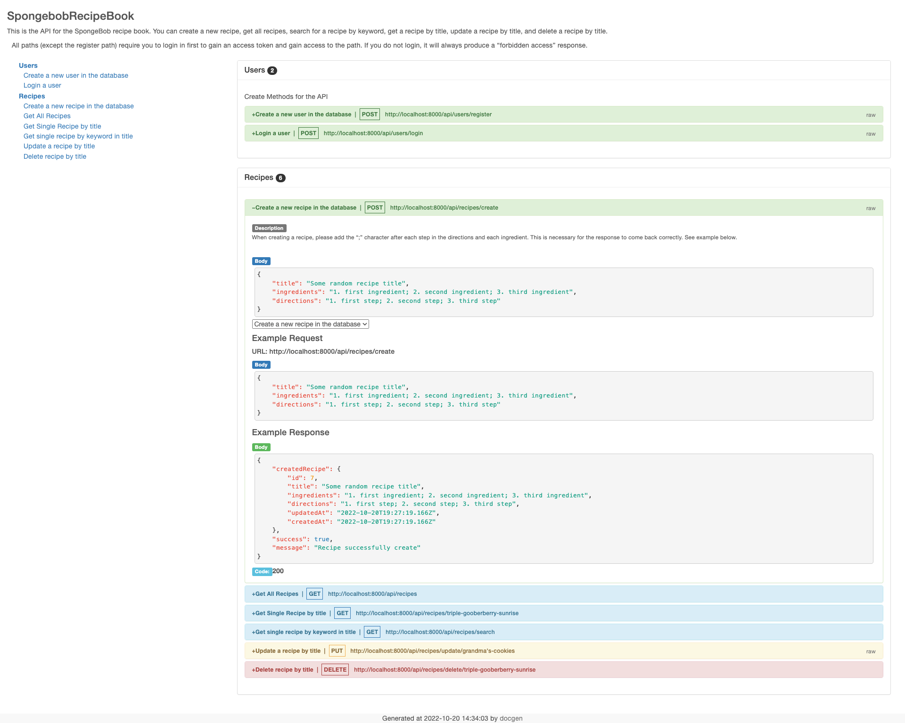

# Spongebob Recipe Book API(Front-End work in progress)

## Table of contents

- [Overview](#overview)
  - [Description](#description)
  - [Screenshot](#screenshot)
  - [Links](#links)
- [My process](#my-process)
  - [Built with](#built-with)
  - [What I learned](#what-i-learned)
  - [Continued development](#continued-development)
- [Author](#author)

## Overview

### Description

This is a recipe book for the residents on Bikini Bottom. Spongebob’s recipe
book is an API that has various recipes seen and used in the Spongebob 
world for anybody to recreate. There are certain recipes that need to remain secret 
(Krabby Patty formula) so, in order to gain access to those recipes you’ll need 
special access privileges. The recipe book has different users and based on the 
user’s status you can access certain recipes. There is a single admin who makes
the decisions on who has access or not and they can give special access 
to certain users. This was built using Node.js, Express.js, RESTful methodology, Sequelize, 
MySQL, Bcrypt, JSON Web Tokens, and tested in Postman.

### Screenshot

### Links

- Live Site URL: Coming Soon

## My process

### Built with

- Node.js
- Express.js
- RESTful Methodology
- MySQL
- BCrypt.js
- JSON Web Tokens
- Sequelize
- Tested in Postman

### What I learned

During this process, I learned a lot about user authorization and permissions. I had to think a few steps ahead and anticipate different permissions and how they'd effect the overal route process. I learned the importance of middleware for user authorization and to set permission level before calling the route's controller function. I learned how to use bit masking to validate user permission access to certain things. I learned the importance of using proper HTTP response codes. I learned how to use slugs in the API endpoint so I don't expose the item ID in the database. Finally, I learned the importance of seperation of concerns for routes and controllers to have a scaleable application.

### Continued development

In the future, I'd like to have a set of admin access routes that are specific to the admin user so they can manage user permission levels. Additionally, I'd like to have a deeper understanding of bit masking and how to properly use that method to create user permission levels. Finally, I would like to create a Front End to display this API in am interactive to use case. 

## Author

- Website - [Matthew Jovenal - GitHUb](https://github.com/GuppyForLife)
